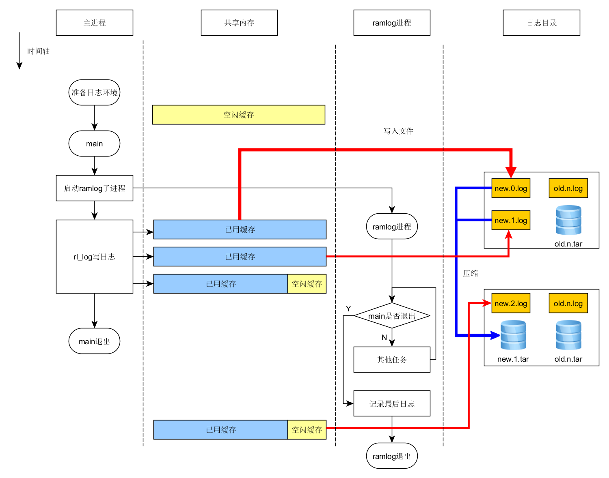

# RamLog
--------

内存日志 V1.0  
早期版本 [V0.1](./README-V0.1.md)

## 目的
------
ramlog 目的是 **提供一种低开销的日志记录器** ，作为研发期间至正式发布后的日志记录
工具。

syslog 是一种工业标准的协议，可用来记录设备的日志。在UNIX系统，路由器、交换机等
网络设备中，系统日志(System Log)记录系统中任何时间发生的大小事件。藉以追踪掌握与
设备和网络有关的状况。

而他有个不如人意的地方 ——**太慢** 。syslog 适合已经长期测试稳定的系统，这类系统应
该记录精简，对syslog开销不苛刻。

对于正在研发过程的项目，日志更多的是为了 **记录应用的执行过程** 分析错误报告，难免
需要频繁的写入操作， syslog 的写入开销会影响系统与外部的开销。

目前ramlog尚不支持网络功能，后期会支持，极有可能向syslog靠拢，特别是syslog拥有记录
日志到数据库的功能。


## 特性
-------

- **快速响应**  
以空间换时间，所有日志均写入缓存，当缓存填满或主动要求保存才写入存储器

- **低IO消耗**  
由于以缓存中转，减少读写存储器操作频度，延长存储器使用寿命

- **日志压缩**  
高效利用存储器空间，当日志重量达到限定值压缩总日志，若压缩后的内容依旧超容量，
则只保留近期压缩日志（目前依赖外部命令支持，有会自身支持）

- **高亮日志**  
终端下自由组合日志颜色，方便阅读


## 机制
-------

ramlog环境在应用程序进入main之前已经准备好。
ramlog以子进程方式运行，该进程与父进程之间以共享内存方式交互日志内容日志的缓存
是一个环形缓存，反复被新内容覆盖，ramlog进程主要做如下工作：

1. 每秒探测一次父进程是否退出，退出则保存父进程最后残留的日志写入存储区（主要工作）

2. 接收外来信号（可能来源于主进程或外部shell）同样保存日志内容

3. 保证总日志容量不错过限制，对日志压缩




## 编译
-------
本工程管理方法及配置逻辑参考 [MakeDoxygen] 

```
$ make
    ARCH       [x86] 
    create     lib-x86/libramlog.so 
    create     lib-x86/libramlog.a 
```

## 例程
-------

ramlog如何使用以及基本特性功能测试均在 example 里，具体测试方法查阅相应源码和目录下的
[README.md](./example/README.md)  


## 下载
git clone https://github.com/MenglongWu/ramlog.git

## 联系/缺陷报告
MenglongWoo@aliyun.com


[MakeDoxygen]:https://github.com/MenglongWu/MakeDoxygen

