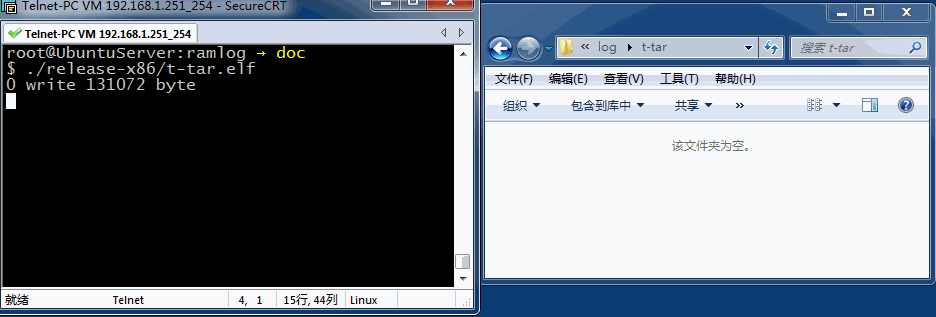

# Ramlog 测试例程

请按照如下介绍的顺序阅读例程，某些演示可能需要重新使用make menuconfig修改配置成
Debug版才能快速查阅演示结果，具体配置查看源码开头的注释

- **t-log**  
演示如何使用ramlog  
程序启动后创建ramlog子进程，父子进程之间共享内存

- **t-logring**  
演示 ramlog 环形缓存  
限制日志缓存只有 50 Byte，当线性缓存被使用完毕后从头循环使用，在主程序结束后
只将最后在缓存内容写入日志。

- **t-dump**  
演示在同时使用 rl_log rl_logring 会遇到的现象
如果最后将缓存占满的是 rl_logring 则之前由 rl_log 填充的数据将一同丢失

- **t-tar**  
管理总日志空间和压缩

- **t-type**  
演示日志输出格式类型，方便阅读

- **t-speed**  
演示ramlog、syslog、printf终端打印效率

- **t-signal**  
外部信号触发ramlog保存日志

- **t-printl**  
演示printf调试信息打印级别(与ramlog无关)
